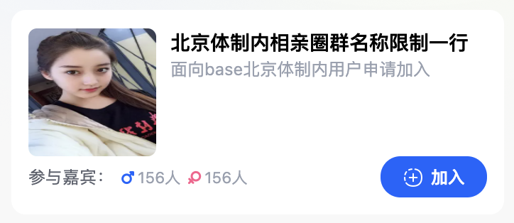
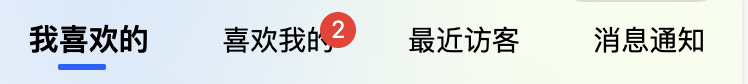

## jdzActivityCard

[jdzActivityCard](jdzActivityCard/)

## jdzBanner

[jdzActivityCard](jdzBanner/)

## jdzDefNavHeader

[jdzDefNavHeader](jdzDefNavHeader/)

## jdzImgCard

[jdzImgCard](jdzImgCard/)

## jdzDefNavHeader

[jdzDefNavHeader](jdzDefNavHeader/)

## jdzIndexInfo
[jdzIndexInfo](jdzIndexInfo/)

## jdzIndexToSeek
[jdzIndexToSeek](jdzIndexToSeek/)

## jdzMsgCard
[jdzMsgCard](jdzMsgCard/)

## jdzMsgItem
[jdzMsgItem](jdzMsgItem/)

## jdzTab
[jdzTab](jdzTab/)

## jdzUpImage
[jdzUpImage](jdzUpImage/)

## jdzinput
[jdzinput](jdzinput/)

## tips
[jdzinput](tips/)

